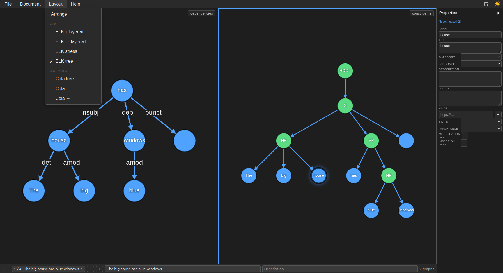
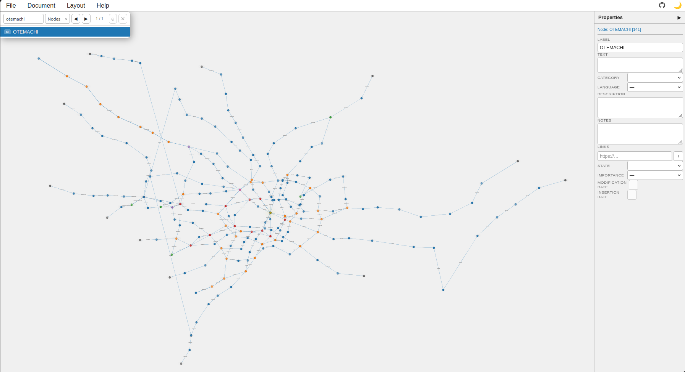

# Directed Graph Editor

A lightweight, client-side directed graph editor built with vanilla JS and Canvas. No build step, no framework.



*Two graphs of one sentence side by side. Each panel says what it holds, and the
node clicked in the right one is being edited in the properties drawer.*



*The same editor on a 216-node graph, in the light theme, searching by label.*

## Interactions

| Gesture | Action |
|---|---|
| Right-click → drag | Create node and edge |
| Right-click on node (no drag) | Context menu: create connected node by category |
| Ctrl + right-click | Insert subgraph from indented or list notation |
| Left-click | Select node or edge |
| Ctrl + click (node) | Add / remove from multi-selection |
| Ctrl + double-click (node) | Select entire connected component |
| Ctrl + click (edge) | Reverse edge direction |
| Drag on empty space | Rubber-band area selection |
| Drag selected node | Move all multi-selected nodes |
| Middle + drag | Pan |
| Mouse wheel | Zoom viewport |
| Ctrl + mouse wheel | Scale node positions about cursor (spread / compress) |
| Middle double-click | Center graph |

## Keyboard shortcuts

| Key | Action |
|---|---|
| Ctrl+Z | Undo (up to 6 steps) |
| Ctrl+Y / Ctrl+Shift+Z | Redo |
| Ctrl+C | Copy selected nodes (+ internal edges) |
| Ctrl+V | Paste (offset +30 px) |
| F2 | Rename selected node or edge (or all selected) |
| F3 | Cycle category to same value across selection |
| Ctrl+F3 | Cycle node shape independently per node |
| Shift+F3 | Cycle node colour independently per node |
| F4 | Toggle lock |
| F6 | Focus properties panel |
| F12 | Ollama query for selected node |
| Del | Delete selection (if unlocked) |
| Alt + ← / → | Node visit history |
| Ctrl+F | Search panel (nodes by default) |

Everything above acts on **the focused panel**: each panel has its own undo
history, its own selection and its own search. These two act on the **document**
instead:

| Key | Action |
|---|---|
| Ctrl + ← / → | Focus the panel to the left / right, scrolling to it |
| Click on a panel | Focus it |

## Automatic layout

Via the **Layout** menu. Available engines: **ELK** (default: tree), **WebCola**.
Selecting a layout option applies it immediately. Dagre and Graphviz options are present but commented out.

## Modules

| File | Role |
|---|---|
| `custom/config.js` | Schemas, category styles, key bindings — main customisation surface |
| `custom/ollama.js` | F12 → Ollama API query → inserts result nodes |
| `js/base.js` | `GraphEditor` class — canvas, events, undo/redo, clipboard, save/load |
| `js/layout.js` | Layout algorithms (ELK, WebCola, Dagre, Graphviz) |
| `js/visualPatterns.js` | Node shapes and colours; overrides `drawNodeShape` and `TYPES` |
| `js/propertiesEditor.js` | Schema-driven side panel and inline popup |
| `js/nodeHistory.js` | Alt+← / Alt+→ navigation history |
| `js/search.js` | Ctrl+F search panel |
| `js/extra.js` | Example graph generator; subgraph insertion modal |
| `js/document.js` | The document layer: a file may hold more than one graph |

Optional modules are independent — any can be removed without breaking the core.

## Save / load

Graphs are saved as JSON (nodes + edges with all properties). All processing is
local; no server required.

**Where the dialog opens.** An `<input type="file">` cannot say, so the browser
picks the last folder any page used and you go hunting for yours every time.
Where the File System Access API exists — Chrome, Edge, Brave and the rest of
the Chromium family — File → Load… and Save go through it with an `id`, and the
browser then remembers the last folder *for this editor*, kept apart from every
other page. Save writes back to the file you opened; **Save as…** always asks.

Firefox has no such API and nothing on a page can change that there: it falls
back to the `<input>` and to a download, which is exactly what this editor
always did. Everything is feature-detected, so a browser that blocks the API
falls back rather than breaking. The API also needs a served page — on `file://`
there is only the fallback.

**File → Samples** sidesteps the dialog altogether and therefore works the same
everywhere. The list comes from [`samples/index.json`](samples/index.json); add a
sample by adding a line there.

## Documents: more than one graph in a file

```
document = { …metadata, graphs: [ element, … ] }

element  = graph                          one graph, one panel
         | { …metadata, graphs: [ … ] }   several, side by side

graph    = { …metadata, nodes: [ … ], edges: [ … ] }
```

`graphs` is always a list, at both levels, so the key means one thing and reading
it never asks which of two shapes this is. A lone graph is a collection of one.

Every level is an object with its own metadata and the list below it, and each is
known by its own keys — `nodes` for a graph, `graphs` for anything holding
graphs — never by nesting depth. No level is a bare array, so any of them can
gain a field later without breaking what is already written.

Two levels of container and no more: the interface has exactly two dimensions,
panels side by side and groups you page through. A third would have nowhere to be
shown, and depth you cannot display is depth you lose on save.

**Read**: this shape, plus two older ones that keep opening — a bare
`{nodes, edges}` (every file this editor wrote before) and a bare
`[ {…, graphs:[…]}, … ]` (what the transformation fork writes).
**Written**: this shape only, in the shortest form that loses nothing. The output
is a function of the content and not of what you opened, so two files with the
same content give the same text — and an old file opened and saved comes back
converted.

Whatever the editor does not show it still writes: the document's metadata, a
group's description and timestamps, a graph's `validated` flag, and any graph
past the last panel. Metadata is kept **by exclusion** — everything that is not
`graphs`, `nodes` or `edges` — so a field this editor has never heard of survives
too.

**The data decides the interface.** Open a file with one graph and the page is
the page it has always been. Open a collection and a bar appears at the bottom to
move through the groups and edit their name and description; a group holding two
graphs opens two panels, and a graph with a `name` shows it in the corner of
its panel. `MAX_PANELS` in `js/base.js` is the ceiling — how many panels this
page *could* show — and the group says how many it wants. Whatever does not fit
is still written back on save, and the bar says so.

The **Document** menu holds the shape commands. Everything in the first group
acts **on the focused panel**, which is the rule the rest of the editor already
follows:

| | |
|---|---|
| Add graph before · after | Insert an empty graph beside the focused one. |
| Duplicate graph | Insert a copy of it, **keeping the node ids**. The same id in two graphs means the same element, so you start with everything paired and break pairs as you edit — which is how a transformation gets authored, and why this is its own command and not a variant of adding. |
| Remove graph | Take it out; the last graph of a group takes the group with it. Always asks, empty or not: with three panels open, which one has the focus is not obvious enough to act on silently. |
| Add group · Previous · Next | Move through the collection. |

### A long row

`MAX_PANELS` in `js/base.js` is 50, and the page builds the canvases itself, so
raising or lowering it is that one number. **Ctrl+←** and **Ctrl+→** move the
focus one panel along and bring it into view — Alt+← / Alt+→ remain the node
history's.

A long row is still a comparison because a pipeline is read **between adjacent
panels**: step 12 beside step 13 is all anyone needs at once, and that stays
true however long the chain is.

How wide a panel gets is a policy in `styles.css`, not a number:

```css
--panels-at-once: 5;    /* the target, when there is room for it */
--panel-floor: 240px;   /* narrower than this a graph is not readable */
```

Five at a time shows two steps of context each way. The basis is a percentage of
the row, so it re-derives itself when the window resizes and when the properties
drawer collapses; the floor stops it there and **the floor wins**, because a
share of a narrow window is a panel too small to hold a graph. Past that the row
scrolls. A group of two or three graphs still shares the whole width — the floor
is a minimum, not a size.

| window | row | panel | at once |
|---|---|---|---|
| 1920 | 1680 | 336 px | 5 |
| 1440 | 1200 | 240 px | 5 |
| 1280 | 1040 | 240 px | 4.3 |
| 1024 | 784 | 240 px | 3.3 |
| 800 | 560 | 240 px | 2.3 |

The cost is linear and worth knowing: a canvas holds `width × height × 4` bytes,
so thirty 240 px panels are about 22 MB of buffers. Panels the current group does
not use hold nothing at all.

A group may end up holding more graphs than there are panels. That is allowed
rather than refused — the editor has to be able to author the files it can read —
and the group bar says how many are on screen and that the rest are written back
untouched.

### Samples

| | |
|---|---|
| `sample.json`, `*_underground.json`, `*_metro.json` | One graph. |
| `sample_legacy.json` | The same, in the pre-document `{nodes, edges}` format, kept so the older reading stays exercised. |
| `parse_pairs_ES.json`, `parse_pairs_EN.json` | One sentence, two analyses: spaCy dependencies and Stanza constituents. The tokens share ids; the phrase nodes exist only in the second. The two files hold the same four sentences, so the three pair samples can be read against each other. |
| `translation_pairs.json` | One sentence and its translation: English in the first panel, Spanish in the second. Paired words share an id even when the order changes (`big` / `grande`); what one language says and the other leaves out has no pair and is drawn in red. |

The Spanish and English constituency trees are **not labelled alike**: Spanish
comes from AnCora, where `sn` is the phrase and `grup.nom` its head with
adjuncts, and English from the Penn Treebank, which does not draw that
distinction. Hence "La casa grande…" in 19 nodes and "The big house…" in 12: the
English tree is flatter because its training corpus annotates less, not because
the sentence is simpler.

Every pair sample says in its `tools` which models produced it, by exact name.
They are generated outside this repository, by a script that runs spaCy and
Stanza and then asks the editor itself for the positions, through Layout →
Arrange — a hand-made grid is fine for a dependency tree and unreadable for a
constituency one.

## Third-party code

Nothing is bundled: the layout engines are loaded from unpkg at runtime, and the
editor works without them — only the **Layout** menu goes quiet. Licences below
are the `license` field each package publishes on npm, checked 2026-08-26.

| | | |
|---|---|---|
| [elkjs](https://github.com/kieler/elkjs) 0.12.0 | ELK layouts (`elk-*`) | **EPL-2.0 OR GPL-3.0-or-later** |
| [WebCola](https://github.com/tgdwyer/WebCola) 3.4.0 | Cola layouts (`cola*`) | MIT |
| [@viz-js/viz](https://github.com/mdaines/viz-js) 3.24.0 | Graphviz layouts (`gv-*`) | MIT — it embeds Graphviz itself, which is **EPL-1.0** |
| [dagre](https://github.com/dagrejs/dagre) 0.8.5 | Dagre layouts (`dagre-*`) | MIT — the `<script>` is commented out in `index.html`; the code in `js/layout.js` stays |

**elkjs is the one to look at before redistributing**, because EPL is a weak
copyleft and the alternative on that dual licence is the GPL: linking to it from
a page is fine, and shipping a modified elkjs is not the same thing. The others
are permissive.

`img/pinned-octocat.svg` is GitHub's Octocat, used as the link to the repository.
GitHub's marks are theirs and their [logo
policy](https://github.com/logos) governs reuse; swap the file if that is a
problem for your fork.

## Theming

Light / dark mode via CSS variables. Initial theme follows the OS preference; toggle with ☀️ / 🌙 in the menu bar.

## Ollama integration

F12 on a selected node opens a prompt sent to a local Ollama instance (`http://localhost:11434`). The response is parsed as a JSON array and inserted as connected nodes. Configure model and prompt template in `custom/ollama.js`.

Requires Ollama running with `OLLAMA_ORIGINS=*` (needed for browser CORS):
```bash
docker run -d --name ollama_API --restart always \
  -v ~/.IAmodels:/root/.ollama -p 11434:11434 --gpus all \
  -e OLLAMA_ORIGINS='*' ollama/ollama
```
