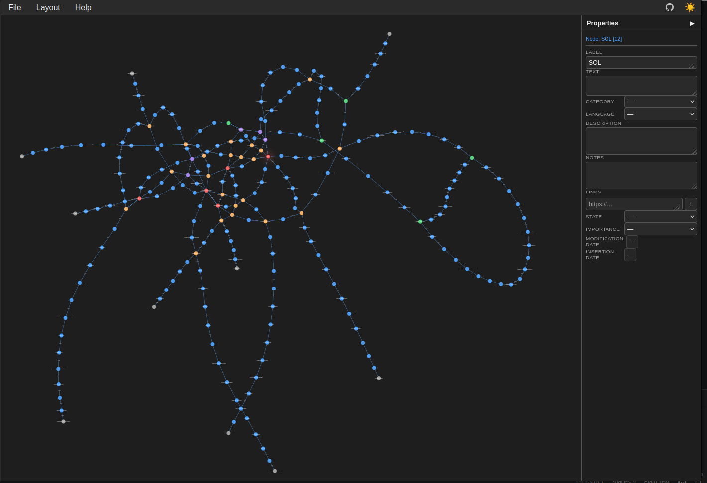

# Directed Graph Editor

A lightweight, client-side directed graph editor built with vanilla JS and Canvas. No build step, no framework.



## Interactions

| Gesture | Action |
|---|---|
| Right-click → drag | Create node and edge |
| Right-click on node (no drag) | Context menu: create connected node by category |
| Ctrl + right-click | Insert subgraph from indented or list notation |
| Left-click | Select node or edge |
| Ctrl + click (node) | Add / remove from multi-selection |
| Ctrl + double-click (node) | Select entire connected component |
| Ctrl + click (edge) | Reverse edge direction |
| Drag on empty space | Rubber-band area selection |
| Drag selected node | Move all multi-selected nodes |
| Middle + drag | Pan |
| Mouse wheel | Zoom viewport |
| Ctrl + mouse wheel | Scale node positions about cursor (spread / compress) |
| Middle double-click | Center graph |

## Keyboard shortcuts

| Key | Action |
|---|---|
| Ctrl+Z | Undo (up to 6 steps) |
| Ctrl+Y / Ctrl+Shift+Z | Redo |
| Ctrl+C | Copy selected nodes (+ internal edges) |
| Ctrl+V | Paste (offset +30 px) |
| F2 | Rename selected node or edge (or all selected) |
| F3 | Cycle category to same value across selection |
| Ctrl+F3 | Cycle node shape independently per node |
| Shift+F3 | Cycle node colour independently per node |
| F4 | Toggle lock |
| F6 | Focus properties panel |
| F12 | Ollama query for selected node |
| Del | Delete selection (if unlocked) |
| Alt + ← / → | Node visit history |
| Ctrl+F | Search panel (nodes by default) |

## Automatic layout

Via the **Layout** menu. Available engines: **ELK** (default: tree), **WebCola**.
Selecting a layout option applies it immediately. Dagre and Graphviz options are present but commented out.

## Modules

| File | Role |
|---|---|
| `custom/config.js` | Schemas, category styles, key bindings — main customisation surface |
| `custom/ollama.js` | F12 → Ollama API query → inserts result nodes |
| `js/base.js` | `GraphEditor` class — canvas, events, undo/redo, clipboard, save/load |
| `js/layout.js` | Layout algorithms (ELK, WebCola, Dagre, Graphviz) |
| `js/visualPatterns.js` | Node shapes and colours; overrides `drawNodeShape` and `TYPES` |
| `js/propertiesEditor.js` | Schema-driven side panel and inline popup |
| `js/nodeHistory.js` | Alt+← / Alt+→ navigation history |
| `js/search.js` | Ctrl+F search panel |
| `js/extra.js` | Example graph generator; subgraph insertion modal |
| `js/document.js` | The document layer: a file may hold more than one graph |

Optional modules are independent — any can be removed without breaking the core.

## Save / load

Graphs are saved as JSON (nodes + edges with all properties). All processing is local; no server required.

## Documents: more than one graph in a file

A file may hold a single graph, as it always could, or a collection of **groups**
of graphs meant to be read side by side.

```
{ nodes, edges }                one graph. Every file this editor ever wrote.
[ { …, graphs: [ … ] }, … ]     a collection of groups.
```

A bare `[ {nodes,edges}, {nodes,edges} ]` is refused rather than guessed at: two
versions of one thing, or two unrelated graphs? Each shape is known by its own
keys — `nodes` for a graph, `graphs` for a group — not by nesting depth.

**The data decides the interface.** Open an old file and the page is the page it
has always been. Open a collection and a bar appears at the bottom to move
through the groups and edit their name and description; a group holding two
graphs opens two panels. `MAX_PANELS` in `js/base.js` is the ceiling — how many
panels this page *could* show — and the group says how many it wants. Whatever
does not fit is still written back on save, and the bar says so.

The **Document** menu holds the shape commands:

| | |
|---|---|
| Split into two | Copy the current graph into a second panel, **keeping the node ids**. The same id in both graphs means the same element, so you start with everything paired and break pairs as you edit. |
| Merge to one | Drop back to a single graph, discarding the others in this group. |
| Add group · Previous · Next | Move through the collection. |

### Samples

| | |
|---|---|
| `samples/sample.json`, `*_underground.json`, `*_metro.json` | One graph, the old format. |
| `samples/parse_pairs.json` | One sentence, two analyses: spaCy dependencies and Stanza constituents. The tokens share ids; the phrase nodes exist only in the second. |
| `samples/translation_pairs.json` | One sentence and its translation: English in the first panel, Spanish in the second. Paired words share an id even when the order changes (`big` / `grande`); what one language says and the other leaves out has no pair and is drawn in red. |

Both pair samples are generated by
`preparando/linguistics/syntax/py/graph_pair_CLAUDE.py` in the portfolio.

## Theming

Light / dark mode via CSS variables. Initial theme follows the OS preference; toggle with ☀️ / 🌙 in the menu bar.

## Ollama integration

F12 on a selected node opens a prompt sent to a local Ollama instance (`http://localhost:11434`). The response is parsed as a JSON array and inserted as connected nodes. Configure model and prompt template in `custom/ollama.js`.

Requires Ollama running with `OLLAMA_ORIGINS=*` (needed for browser CORS):
```bash
docker run -d --name ollama_API --restart always \
  -v ~/.IAmodels:/root/.ollama -p 11434:11434 --gpus all \
  -e OLLAMA_ORIGINS='*' ollama/ollama
```
